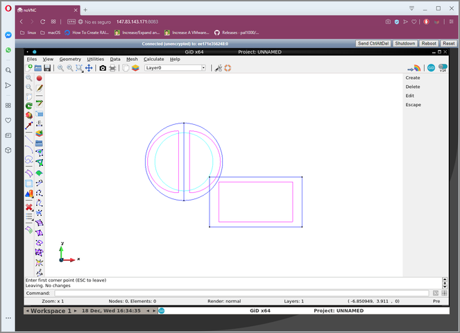

# GiD docker containers and services it provides

* [ Build & Run](# Build & Run docker container)
* [ Services exposed](# Services)
 * [ Graphical interface in browser](## port 8083)

# Build & Run docker containers

to build, tag and publish:

    docker build -t gid-novnc .
    ( fresh build ) docker build --no-cache -t gid-novnc .
    # test run:
    docker run -p 8083:8083 --net=bridge -ti gid-novnc 
    # publishing
    docker tag gid-novnc pasenau/gid-novnc:latest
    docker push pasenau/gid-novnc:latest

to download container (needs *docker login* and account in dockerhub)

    docker pull pasenau/gid-novnc:latest

to run:

    docker run -p 8083:8083 --net=bridge -ti pasenau/gid-novnc 

to run with persistent location (external $HOME/docker-gid-novnc-persistent-files will be mounted inside the image on /root/ExternalStorage):

    docker run -p 8083:8083 \
       --mount type=bind,source="$HOME"/docker-gid-novnc-persistent-files,target=/root/ExternalStorage \
       -ti pasenau/gid-novnc 
    
with an interactive shell:

    docker run -p 8083:8083 --net=bridge -ti pasenau/gid-novnc /bin/bash
    
on linux/windows:

    docker pull pasenau/gid-novnc:latest
    docker run -p 8083:8083 \
          -mount type=bind,source="$HOME"/docker-gid-novnc-persistent-files,target=/root/ExternalStorage \
          -ti pasenau/gid-novnc 

# Services

## Graphical interface in browser: port 8083
is the http://xxx:8083 vnc-like visualization of GiD application in a graphical environment

## Try:
Open browser and connect to:
- Windows [http://192.168.99.100:8083](http://192.168.99.100:8083 "") *(on Windows, docker uses the ip 192.168.99.100 tipically, but check with 'docker-machine ip' to be sure)*
- Linux/macOS [http://localhost:8083](http://localhost:8083 "")
